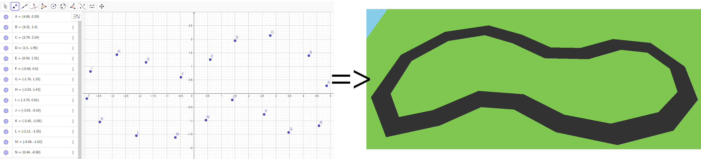
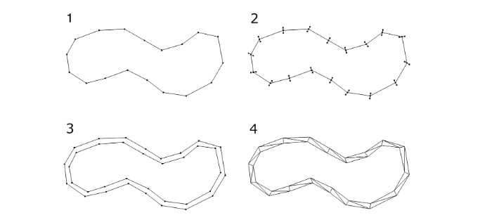
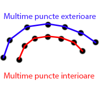
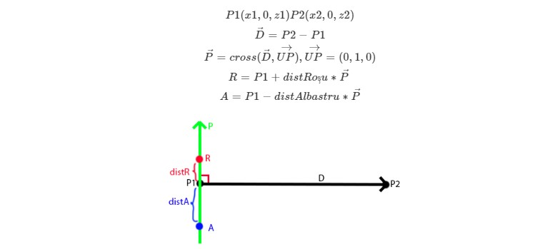
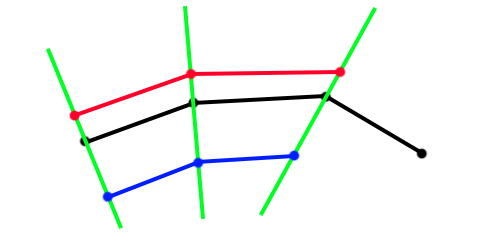
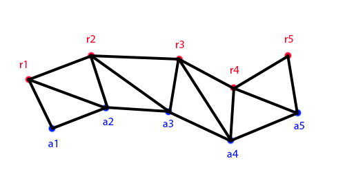
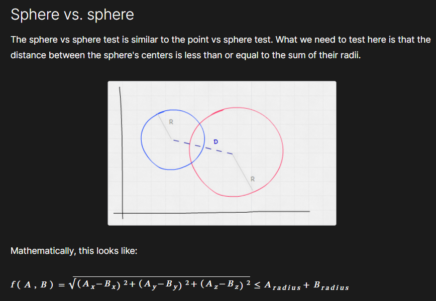
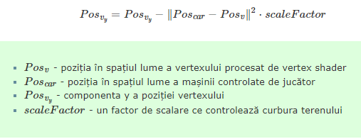
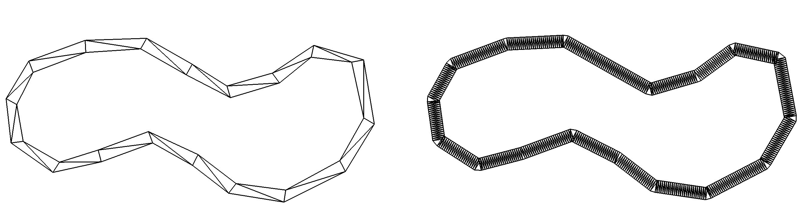

# Car Race
# Race track
&emsp; To generate a track for the car to drive on, initially a lot of points are needed to define it. 
The crowd consists of points in the XOZ (2D) plane and can be obtained using any tool (even paper and pen). 
For the following example, Geogebra was used.

### **Race Track Generation**

Race track generation can be done as per below steps. A visual representation of the results is presented below.

1. Create the points of a polygon that defines the racing track.
2. Two sets of additional points are created, inside and outside the polygon that defines the runway. Points can 
   be created along the perpendicular of each segment. This process is detailed below.
3. Create the edges between the inner and outer polygon points.
4. The triangles between the points of the two polygons are generated. The triangles are created in a single mesh object.

To generate track geometry (a 2D surface), 2 sets of points are needed: one inside and one outside. Each outer segment 
is (roughly) parallel to its inner counterpart.

These 2 sets can be obtained using the tools already discussed, but it is quite expensive in terms of time. A more 
elegant solution is presented next, where from a set of points we can generate any number of sets of points parallel 
to the original set (segment-level parallelism).

Suppose we have 2 consecutive points P1(x1, 0, z1), P2(x2, 0, z2) from the set of points defining the path:

1. Determine the direction vector from P1 to P2 marked D (black in the picture).
2. Determine the vector perpendicular to D denoted P (green in the picture): P = cross(D, UP), UP being the vector 
perpendicular to the XOZ plane.
3. Using the vector P and the position of P1 we can get the outer / inner points (Red and Blue): 
R = P1 + distRed * P, A = P1 - distBlue * P.

Thus, if we apply the same to all segments, we get the new outer / inner point sets:

Having the 2 crowds (outer and inner), we can build the track surface. Suppose we have the outer points r1, r2, r3 
and the inner ones a1, a2, a3. The 4 triangles (r1, a1, a2), (r1, a2, r2), (r2, a2, a3) must be constructed.(r2, a3, r3).

Thus, if we apply the same to all points in both sets we get the track.

A possible better generation uses the average of the perpendiculars on 2 consecutive segments to create the points on 
the two polygons, inner and outer.

### **Move dynamic obstacles**
On the track, in addition to the player's car, other cars (opponents) also move. They move along a predefined route 
parallel to the track-generating crowd. This route can be obtained with the technique shown above.

### **Trackside tree generation**
Beside the track there are trees with a decorative purpose. At least one tree must be visible at all times on the 
screen (requires high tree density). Trees must not block the track.

# Car control
Of all the cars created on the track, one of them is the player's. This can be controlled using the W, A, S, D keys, 
where W-S represents front-back movement and A-D will change the car's orientation (detailed below).

### **Camera control**
The player's perspective is third-person, so we have the camera positioned behind the car, looking towards it. 
For smooth control, the car stays centered in the direction of the camera, so pressing the A-D keys will do both a 
car rotation and a camera rotation:

### **Checking the car if it is on the track**
For simplicity, it is only checked if the center of the car is inside the track. For this, it is checked if the position
of the car (only (x, z)) is in at least one of the triangles that define the geometry of the track.

### **Dynamic obstacle collision check**
In order to have some interaction with enemy cars, they must be detected. This detection involves checking the position 
of the player's car relative to each enemy car. To achieve this, the easiest way is a sphere-sphere collision check:

When the intersection between the player-controlled car and a dynamic obstacle is detected, the player's car stops. 
Any key pressed to control travel or rotation can no longer change the car's position or orientation. This stopping 
effect disappears the moment there is no more intersection.

# Minimap
The minimap is in the lower left corner and is positioned above the car.  

# Land curvature 

### **Creating the curvature from the shader**

Realizes the curvature of the terrain is done at the stage of drawing the objects in the scene. This effect is created 
by changing the y component of the coordinates for all the vertices of the objects in the scene. The process is done in 
the vertex shader. The y-component of all vertices changes as follows.

### **Density of land triangles**

Since the rendering of terrain curvature is a process that changes the positions of the vertices, the visual result is 
influenced by the density of terrain triangles. The higher the density of triangles on the terrain, the more natural the
curvature effect. A low density produces a more 'square' visual result. A comparison of the results of the two can be 
viewed below. On the left is the result for a low density and on the right for a high density.

To remove these visual artifacts, it is necessary to generate the grass field and track with a high density of 
triangles. For example, a comparison between the geometry of the two results above is as follows. Track geometry was 
generated as described above.

